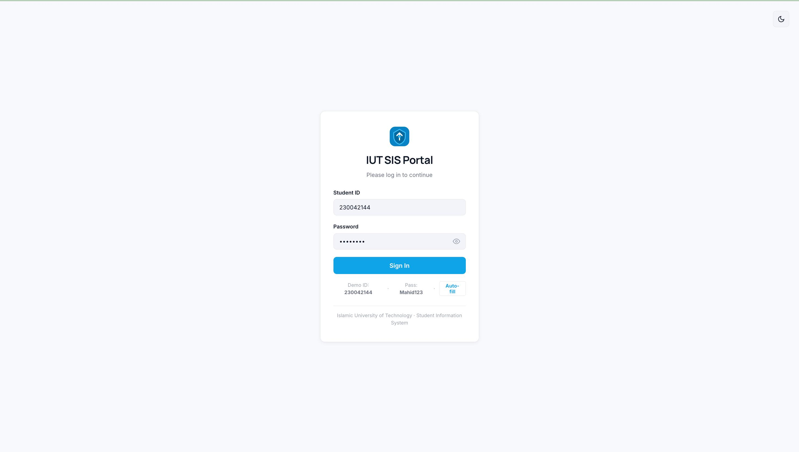
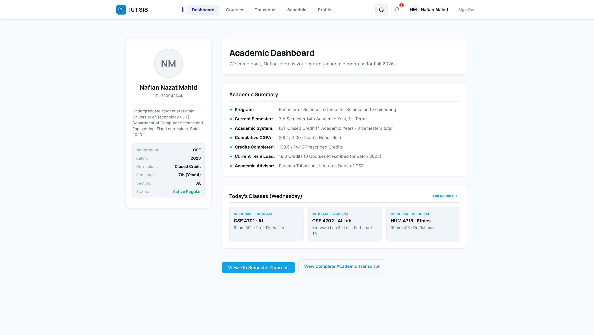
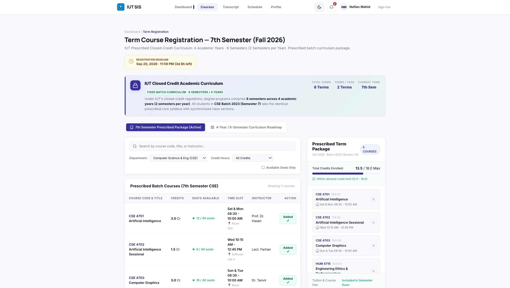
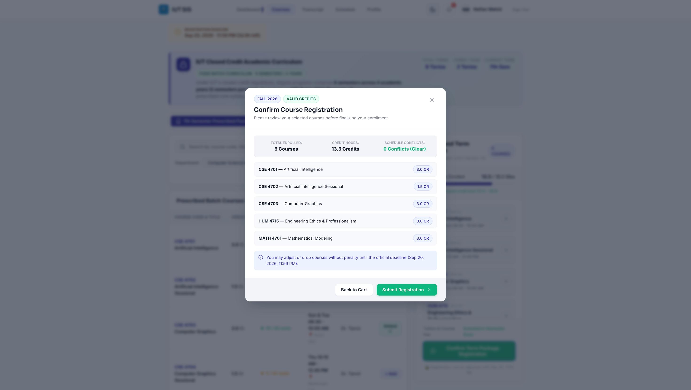
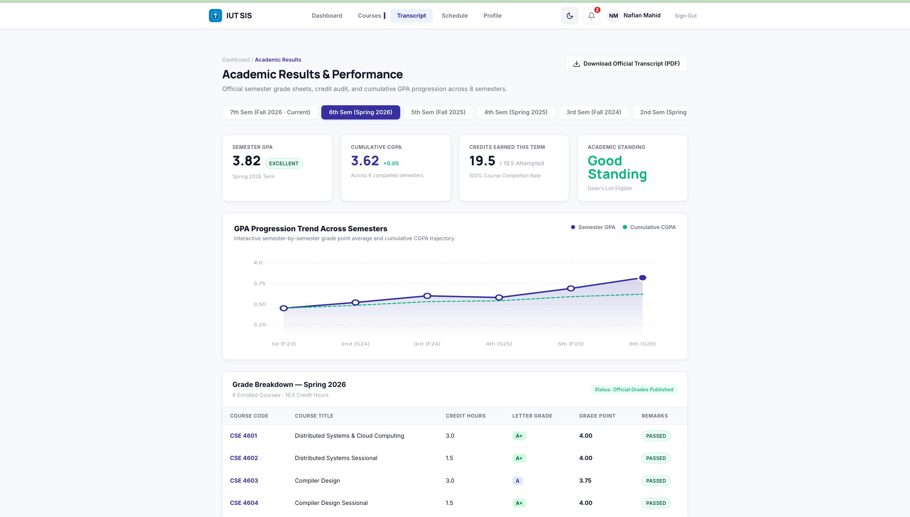
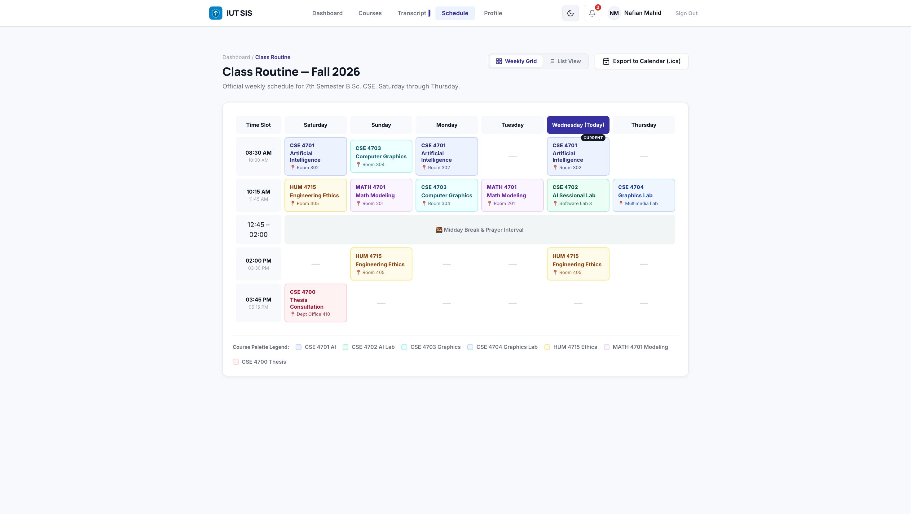
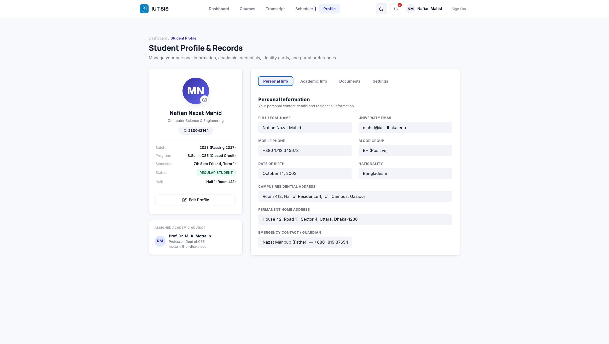

# SRS Assignment 5 — IUT Student Information System (SIS) Prototype

🔗 **Live Demo:** [https://nafianmahid.github.io/IUT-SIS-/](https://nafianmahid.github.io/IUT-SIS-/)

---

### 👨‍🎓 Submitted By
**Nafian Nazat Mahid**  
Student ID: **230042144**  
Islamic University of Technology (IUT)

### 👩‍🏫 Submitted To
**Farzana Tabassum**  
Lecturer, Department of Computer Science and Engineering  
Islamic University of Technology (IUT)

---

## 📌 Project Overview

This prototype is a redesigned, humanized Student Information System (SIS) portal designed specifically for the **Islamic University of Technology (IUT)**. It replaces legacy, cluttered university interfaces with a streamlined, responsive experience tailored to IUT's academic model.

### Key Highlights
- **🏛️ IUT Closed-Credit Curriculum:** Built around IUT's prescribed curriculum structure — **4 Academic Years comprising 8 Semesters (2 semesters per academic year)** with synchronized batch course packages (Section 7A).
- **🔑 Open Demo Access:** Preconfigured with demo credentials (**Student ID: `230042144`**, **Password: `Mahid123`**), while permitting open access for evaluator testing.
- **🌓 Dark Mode & Light Mode:** Fully adaptive theme switching available on both the login screen and the top navigation bar, with preferences saved in `localStorage`.
- **⚡ Proactive Usability:** Live timetable schedule collision detection, 8-semester results tracking with GPA analytics, and interactive weekly class routine management.

---

## 📸 Interactive Screens

### 1. Login Portal
Minimalist, centered student login card featuring one-click demo credentials autofill, password visibility toggle, and top-right dark mode switcher.



---

### 2. Student Dashboard
Two-column overview presenting student profile summary, current semester status, today's lecture schedule, and quick access navigation.



---

### 3. Course Catalog & Registration
Curriculum viewer displaying IUT's 7th-semester prescribed batch package (18.0 credits) alongside the 4-Year / 8-Semester roadmap and live conflict detector.





---

### 4. Academic Results & Transcript
Interactive semester-by-semester grade breakdown covering all 8 semesters (1st to 8th Semester) with cumulative CGPA tracking and transcript export.



---

### 5. Weekly Class Schedule
Weekly timetable grid (Saturday to Thursday) with color-coded course sessions, room locations, active class indicators, and calendar export.



---

### 6. Student Profile & Settings
Comprehensive student record with personal details, academic history, advisor assignment, and portal preferences (appearance & security).



---

## 🚀 Running Locally

The project is built entirely with standard **HTML5, Vanilla CSS, and JavaScript** without any external package dependencies or build steps.

1. Clone or download this repository.
2. Open [`index.html`](index.html) directly in any web browser, or launch with a local server:
   ```bash
   python3 -m http.server 8080
   ```
3. Visit `http://localhost:8080` and sign in using:
   - **Student ID:** `230042144`
   - **Password:** `Mahid123`
